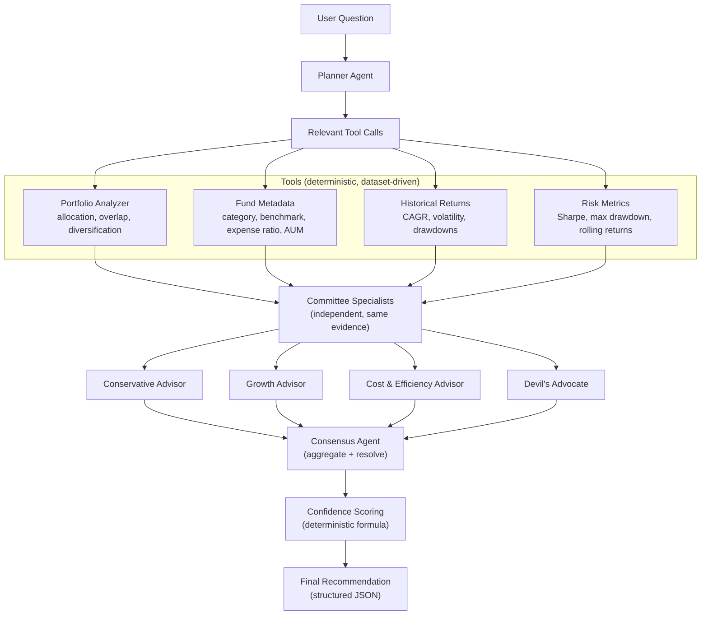

# Investment Committee Agent

An AI system that answers portfolio questions the way a real investment
committee would: multiple specialists with **different priorities** examine
the same **tool-computed evidence**, form **independent opinions**, genuinely
**disagree** where their priorities conflict, and a consensus agent synthesizes
the debate into a single, evidence-backed recommendation with a **transparent
confidence score**.

Built as a take-home internship assignment. It is a learning-grade project:
simple, modular, offline-runnable, and easy to explain end to end.

> **Not investment advice.** All data is synthetic and for demonstration only.

---

## 1. Overview

The user asks a question such as *"Should I redeem Fund X?"*. The system:

1. Plans what tools are needed (Planner).
2. Computes real portfolio facts with deterministic tools.
3. Runs four independent specialist advisors over that evidence.
4. Synthesizes agreements, disagreements, and a final recommendation.
5. Scores its own confidence from measurable signals.

The result is a structured `FinalReport` (JSON) whose `evidence` list is
traceable to the tool outputs — nothing is invented by the model.

## 2. Architecture

```
                       +--------------------------------------------------+
                       |                LangGraph StateGraph              |
                       |                                                    |
  User Question  -->   |  plan  -->  tools  -->  committee  -->  consensus |  -->  finalize
                       |                                                    |
                       +--------------------------------------------------+
```

Agent flow (also see `graph.py`):



Each node in `graph.py` moves a typed object through the shared
`CommitteeState`: `PlannerPlan` -> `ToolResults` -> `CommitteeOpinions` ->
`ConsensusOutput` -> `FinalReport`.

## 3. Committee roles

| Advisor | Mandate | Naturally disagrees with |
| --- | --- | --- |
| **Conservative** | Capital preservation, diversification, downside risk | Growth advisor (risk appetite) |
| **Growth** | Long-term returns, higher risk tolerance | Conservative advisor (over-caution) |
| **Cost & Efficiency** | Overlap, unnecessary funds, expense ratios, simplicity | Anyone tolerating redundant/high-fee funds |
| **Devil's Advocate** | Stress-tests assumptions, finds hidden risks | Everyone — it is *supposed* to |

Disagreement is **preserved**, not forced away. The consensus agent reports
what the committee agrees on, what it disagrees on, *why*, and which side it
ultimately prefers and under which assumptions.

## 4. Tools

Tools are pure functions over the CSV dataset — they compute numbers, they
never guess. The LLM only **interprets** their output.

| Tool | Input | Output |
| --- | --- | --- |
| `portfolio_analyzer` | portfolio | fund/category allocation, pairwise overlap, diversification metrics (HHI, effective fund count) |
| `fund_metadata` | portfolio | category, benchmark, expense ratio, AUM per fund |
| `historical_returns` | portfolio | CAGR, annualized volatility, max drawdown per fund |
| `risk_metrics` | portfolio | Sharpe ratio, max drawdown, 12-month rolling returns |

All metrics assume a 6.5% annual risk-free rate and 60 months of monthly
returns. A `Market Context` tool is intentionally **not** implemented — the
assignment marks it optional, and web search would add API keys, network
failure modes, and non-reproducible answers without proportional value.

## 5. Design decisions

- **One orchestration framework (LangGraph)** because the pipeline *is* a
  directed graph. Each stage is a node; the state object is the only data
  flow. Alternative (a hand-written function chain) was rejected because
  LangGraph was requested and its structure maps 1:1 to the assignment's
  required architecture.
- **Deterministic confidence, not "ask the model".** The score is computed
  from measurable signals (below), so it is explainable and reproducible.
- **Mock LLM for offline runs.** Without an API key the system uses a
  deterministic stand-in that returns the same *structure* as the real model.
  This makes tests free, fast, and reproducible, and demos run anywhere.
  Reasoning quality is shallow in mock mode — use a real model for
  meaningful opinions.
- **Pydantic everywhere.** Every cross-boundary value is validated. A bad
  LLM response or bad input is caught at the boundary, retried, or degraded
  gracefully — never silently propagated.
- **Fictional fund names.** The dataset is synthetic, so it uses fictional
  funds to avoid asserting facts about real products.

## 6. Confidence scoring

The formula (see `confidence.py`) is:

```
score = 0.5 * agreement + 0.3 * tool_health + 0.2 * data_health
        - 0.1 if the committee reported disagreements
        - 0.1 if any tool errored
```

- **agreement** — fraction of advisors whose stance matches the consensus
  preferred stance (`1.0` unanimous, `0.0` none).
- **tool_health** — mean health of requested tools (`ok=1.0`, `partial=0.5`,
  `error=0.0`).
- **data_health** — fraction of funds with sufficient return history
  (`0.5` neutral when history was not requested).

Result is clamped to `[0, 1]`. You can recompute any printed score by hand.

## 7. Assumptions

- Synthetic data: fictional funds and 60 months of generated monthly returns.
- 6.5% annual risk-free rate for Sharpe ratios.
- Allocations are fractions summing to ~1.0; deviations are warned about.
- The committee reasons from the tool evidence only — no live market data.

## 8. Limitations

- The model interprets evidence; it is not a licensed financial advisor.
- Historical metrics are backtests on synthetic data — no predictive power.
- Overlap analysis uses the holdings dataset, not the full fund universe.
- Real-model quality depends on the underlying LLM; the mock is shallow by
  design.

## 9. Setup

```bash
# 1. Create and activate a virtual environment (recommended)
python -m venv .venv
.venv\Scripts\activate          # Windows
# source .venv/bin/activate     # macOS/Linux

# 2. Install dependencies
pip install -r requirements.txt

# 3. Configure the LLM
copy .env.example .env          # Windows
# cp .env.example .env          # macOS/Linux
# edit .env and set LLM_API_KEY

# 4. (Re)generate the synthetic dataset, if needed
python scripts/make_dataset.py

# 5. Run the tests
python -m pytest -q
```

## 10. Environment variables

| Variable | Default | Purpose |
| --- | --- | --- |
| `LLM_API_KEY` | *(empty)* | OpenAI-compatible API key. Empty -> mock LLM. |
| `LLM_MODEL` | `gpt-4o-mini` | Model name. |
| `LLM_BASE_URL` | *(empty)* | Optional OpenAI-compatible endpoint (e.g. Ollama). |
| `LLM_TEMPERATURE` | `0` | Determinism. |
| `LLM_MAX_TOKENS` | `2000` | Output cap. |
| `LLM_TIMEOUT` | `60` | Request timeout (seconds). |
| `LLM_MAX_RETRIES` | `3` | Retries per LLM call. |
| `LLM_MOCK` | `0` | Force mock LLM even with a key (`1`). |
| `LOG_LEVEL` | `INFO` | Logging verbosity. |

Never commit `.env` (it is git-ignored).

## 11. How to run

```bash
# Offline demo (no API key needed — uses the mock LLM)
python main.py "Should I redeem the Pinnacle Small Cap fund?"

# With a real model
python main.py "Am I over-diversified?"

# Custom portfolio file
python main.py "Should I consolidate my portfolio?" --portfolio data/sample_portfolio.json
```

## 12. Example output (excerpt)

```json
{
  "question": "Should I redeem the Pinnacle Small Cap fund?",
  "committee_opinions": {
    "conservative": "The conservative advisor stance on '...': redeem.",
    "growth": "The growth advisor stance on '...': hold.",
    "cost_efficiency": "...",
    "devils_advocate": "..."
  },
  "agreements": ["The advisors are split; no clear majority stance."],
  "disagreements": ["Advisors differ: redeem vs challenge, hold, consolidate."],
  "confidence_score": 0.53,
  "final_recommendation": "On balance, the committee recommends to redeem ...",
  "evidence": [
    {
      "source": "portfolio_analyzer",
      "metric": "diversification",
      "value": "6 funds / 6 categories, effective count 5.56, avg overlap 0.3385",
      "kind": "calculated"
    },
    {
      "source": "fund_metadata",
      "metric": "PINSC expense_ratio",
      "value": "1.55%",
      "kind": "dataset"
    }
  ],
  "assumptions": ["Risk-free rate assumed at 6.5% for Sharpe ratios."],
  "tool_errors": [],
  "tool_warnings": []
}
```

Evidence items are tagged `calculated` (computed by tools), `dataset`
(metadata facts), or `assumption` — so facts and interpretation never blur.

## 13. Evaluation

`python -m pytest -q` runs the suite in `tests/`:

| File | Covers |
| --- | --- |
| `test_models.py` | Schema validation (bad allocation, bad risk profile, confidence bounds) |
| `test_tools.py` | Tool correctness (allocation, overlap, drawdown, Sharpe), unknown fund, empty portfolio, insufficient data |
| `test_confidence.py` | Confidence formula behaviour under every signal |
| `test_graph.py` | Full pipeline: opinions, disagreements, evidence, determinism |
| `test_failures.py` | LLM outage, invalid portfolio files, unknown funds, empty portfolio |

The graph tests use the mock LLM, so the suite is deterministic and free.

## 14. Failure handling

Every failure mode listed in the assignment is handled explicitly:

| Failure | Behaviour |
| --- | --- |
| LLM API failure | Retry with backoff -> per-agent fallback (default plan / "could not conclude" opinion / explicit no-consensus) |
| Invalid LLM structured output | Validation error is sent back to the model to repair, then retried |
| Tool failure | Caught per tool; status recorded as `error`; pipeline continues |
| Empty portfolio | `partial` status + warning surfaced in `tool_warnings` |
| Unknown fund | Skipped with warning; evidence still built for known funds |
| Missing metadata | Same skip-with-warning behaviour |
| Insufficient history | `insufficient_data` flag; specialists are told not to over-rely |
| Invalid portfolio file | CLI prints a clear message and exits non-zero |

Nothing crashes silently; degraded results are always labelled.

## 15. Project structure

```
.
├── README.md
├── requirements.txt
├── pyproject.toml          # pytest config
├── .env.example
├── .gitignore
├── main.py                 # CLI entry point
├── config.py               # env vars, paths, logging
├── models.py               # all Pydantic schemas
├── confidence.py           # deterministic confidence scoring
├── graph.py                # LangGraph wiring + report assembly
├── data/                   # synthetic dataset (generated)
├── scripts/make_dataset.py # reproducible dataset generator
├── agents/
│   ├── llm.py              # OpenAI-compatible + mock clients, retries
│   ├── prompts.py          # role definitions + evidence digest
│   ├── planner.py          # Planner Agent
│   ├── specialists.py      # four committee members
│   └── consensus.py        # Consensus Agent
├── tools/
│   ├── data_loader.py      # CSV access (cached)
│   ├── metrics.py          # shared financial math
│   ├── portfolio_analyzer.py
│   ├── fund_metadata.py
│   ├── historical_returns.py
│   ├── risk_metrics.py
│   └── registry.py         # tool dispatch + reliability boundary
└── tests/
    ├── conftest.py
    ├── test_models.py
    ├── test_tools.py
    ├── test_confidence.py
    ├── test_graph.py
    └── test_failures.py
```
